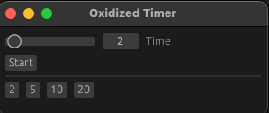

# oxidized-timer



I was using a simple [timing app](https://apps.apple.com/us/app/onigiri-menu-bar-timer/id1639917298) that would play a beep after a certain amount of time. Unfortunately, it wanted me to pay. No thanks. So, I wrote this small little app with [egui](https://github.com/emilk/egui). For the beep sound, I use an asset from [rodio](https://github.com/RustAudio/rodio), which is under the MIT license.

## To Run

```
cargo run
```